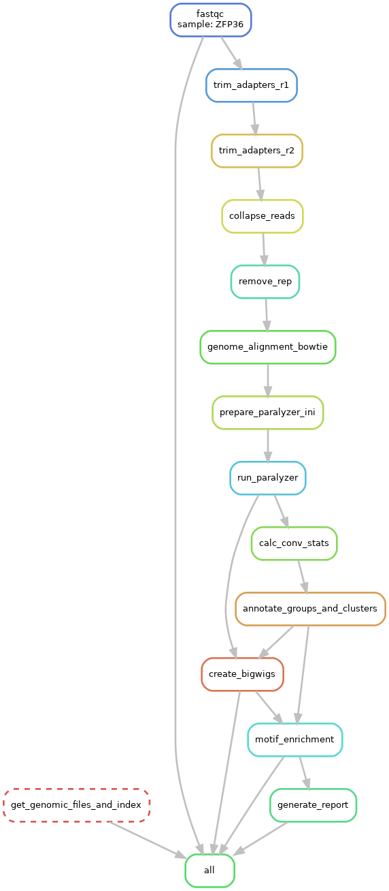

# CLIPs4U
CLIPs4U is the snakemeke workflow to analyze PAR-CLIP data. 

## Overview

[Introduction](#introduction)

[Prerequisites](#prerequisites)

[Dependencies](#dependencies)

[Preparing configuration file](#preparing_configuration_file)

[Workflow](#workflow)

[Usage](#usage)

[Output](#output)

[Contributors](#contributors)

[License](#license)

## Introduction
CLIPs4U runs whole analysis starting from gzipped fastq files end ending with annotation tables using single command and yaml configuration file. It is user friendly and a highly customizable tool.


## Prerequisites
The only thing you must know before running CLIPs4U is the location of your fastq.gz files and your adapters sequences. If you want you can also provide your own genome version and annotation, star index etc (see below). 

## Dependencies
Required libraries are stored in the `env.yml` file. All required dependencies can be installed using *conda* by executing the following command:
```
conda env create --name clips4u --file env.yml
```
Where clips4u is your name of the environment.

NOTE: creating environment will take some time, a few hundred packages must be downloaded and installed.

The environment then needs to be activated in order to run CLIPs4U:
```
conda activate clips4u
```

We also plan to provide Docker image soon.

## Preparing configuration file
Most of the parameters for CLIPs4U run have to be set up in your custom [YAML](https://en.wikipedia.org/wiki/YAML) file (for example `config.yaml`). 
You can edit `config.yaml`, which is an empty config file in any text editor and set all parameters.

NOTE: only 3'adapter and 5'adapter sequences are absolutely required.

NOTE: when you do not provide path to your input file(s) CLIPs4U will run with test dataset and your config file.

The configuration file contains seven main sections:
* exec and input paths and hardware settings
* genome file and genomic annotations
* adapter trimming and reads collapsing
* removing repetitive elements
* genome alignment
* PARalyzer params
* motif enrichment params
  
Default configuration file is stored in `config/default_config.yaml`

Exec and input paths and hardware settings section contains two fields; the `input_files` field where you specify path(s) to input fastq.gz file(s). When you have more than one input, separate paths by comma. In the `threads` field you specify maximum naumber of processors used by the rules within workflow. 

Section from default config is shown below.
```
{
    #exec and input paths and hardware settings
    'input_files': "", #(REQUIRED)absolute path(s) must be provided by user in config file, if > 1, comma separated
    'threads': 4,
```

Genome file and genomic annotations contains five fields. The first one specify organism. Right now you can choose human or mouse (`"hs"` or `"mm"`). If you want to run your analysis with data from other organism(s) open an issue and|or write an e-mail to marcin.sajek@gmail.com and we will prepare the data and|or modify scripts.
`genome_fasta` and `gtf` fields contain paths to genome sequence and gtf files. When empty (`""`) both genome and its annotation will be downloaded from gencode. Gencode version of genome and gtf is specified in the `genome_version` field. The default version for human genome is 45, and for mouse - 35. 

NOTE: Gencode versions for both organism must be greater than 4

`annot_rank` field contains path to annotation ranking file. If empty, default annot rank file will be used. This file contain categories from `gene_type` field of gtf file, and if the peak is mapping to region with multiple annotations, lowest rank is chosen. The most abundant RNA types have highest ranks.

Section from default config is shown below.
```  #genome file and genomic annotations
    'organism' : "hs", #(OPTIONAL) allowed values are "hs" for human and "mm" for mouse
    'genome_fasta' : "", #(OPTIONAL) you can specify your own genome file, if not specified GRCh38/GRCm39 primary assembly from gencode v45 will be automatically downloaded
    'gtf' : "", #(OPTIONAL) you can specify your own gtf file (compatible with genome), if not specified basic annotation for GRCh38/GRCm39 primary assembly from gencode v45 will be automatically downloaded
    'genome_version' : "", #(OPTIONAL) you can specify your own genome/gtf version; default: GRCh38/GRCm39 primary assembly from gencode v45/35
    'annot_rank' : "", #(OPTIONAL) you can specify your own annotation rank file, suggesed when using your own genome; default: CLIPs4U/annotation/{organism}/annot_ranks.txt
```

Adapter trimming and reads collapsing section contain adapter trimming parameters. Please familiarize yourself with [cutadapt](https://cutadapt.readthedocs.io/en/stable/guide.html) before filling this section. For some analyses it may be better to split adapter trimming into two rounds. If you want to do it in one step fill `cutadapt_params1` field and leave `cutadapt_params2` field with empty quotes ```cutadapt_params2 : ""```, which is a default setting. If yor sequencing was performed on NextSeq or NovaSeq machine consider setting `nextseq` to `True`, to remove a ‘dark cycle’ encoded as string of Gs. If you have UMIs in your read set the length of UMI in `umi` field. If your UMIs are in the 5' end of the read use positive integer, if at the 3' end, negative integer.

Section from default config is shown below.
```
    #adapter trimming and reads collapsing
    'three_prime_adapter' : "", #(REQUIRED!!!) put your 3'adapter sequence
    'five_prime_adapter' : "", #(REQUIRED!!!) your 5'adapter sequence
    'nextseq' : False, #(OPTIONAL) put True or 1 if your sequencing run was on NextSeq machine
    'cutadapt_params1' : "-b CGTACGCGGGTTTAAACGA -b CTCATCTTGGTCGTACGCGGAATAGTTTAAACTGT -n 3 -j 0 -m 15 -M 50 --max-n 1", #(OPTIONAL) - additional cutadapt parameters
    'cutadapt_params2' : "", #(OPTIONAL) leave empty to ommit this step, if you want to perform second trimming put all cutadapt parameters for 2nd trimming here (including adapters)
    'umi' : "", #(OPTIONAL) leave empty if you don't have UMIs, for 5' UMIs positive integer equal UMI length, if 3'UMIs - negative integer equal UMI length
```

TIP: ```-j 0 ``` in cutadapt determined automatically numbers of available threads.

TIP: Reads that are to long can cause further issues with PARalyzer. Consider setting a max read length parameter, e.g. `-M 50`.

Removing repetitive elements section is skipped with default settings. User can perform removing repetitive element before genome alignent by setting `rem_rep` to `True`. CLIPs4U is using [STAR](https://raw.githubusercontent.com/alexdobin/STAR/master/doc/STARmanual.pdf) for this task. It is using default repetitive elments index and STAR parameters if `rep_idx` and `star_rem_reps_params` are empty.

Section from default config is shown below.
```
    #removing repetitive elements
    'rem_rep' : "",  #(OPTIONAL) leave empty to omit this step, put True or 1 if you want to remove repetitive elements
    'rep_idx' : "", #(OPTIONAL) default: CLIPs4U/annotation/{organism}/rep_idx
    'star_rem_reps_params' : "--runMode alignReads --genomeLoad NoSharedMemory --alignEndsType EndToEnd --outSAMunmapped Within --outFilterMultimapNmax 30 --outFilterMultimapScoreRange 1 --outSAMtype BAM Unsorted --outFilterType BySJout --outBAMcompression 10 --outReadsUnmapped Fastx --outFilterScoreMin 10 --outSAMattrRGline ID:foo --outSAMattributes All --outSAMmode Full", #(OPTIONAL)
```

Genome alignment section of the configuration file contains a parameters list passed to  aligner. Default aligner is [bowtie](https://bowtie-bio.sourceforge.net/index.shtml). User can switch aligner to [STAR](https://raw.githubusercontent.com/alexdobin/STAR/master/doc/STARmanual.pdf) by filling `aligner` field with one of `"STAR"`, `"star"`, `"S"` or `"s"`. Remaining fields contain paths to bowtie or STAR indexes (generated automatically for selected aligner if left empty) and aligner parameters (filled with default settings when empty). 

Section from default config is shown below.
```
    #genome alignment
    'aligner' : "",  #(OPTIONAL) default bowtie, use 'S', 's', 'STAR' or 'star' to switch to STAR
    'bowtie_index_dir' : "", #(OPTIONAL) default - will be created automatically in your working dir if aligner will be set to bowtie
    'bowtie_index_params' : "", #(OPTIONAL)
    'bowtie_map_params' : "-v 1 -m 10 --best --strata -S", #(OPTIONAL)
    'star_index_dir' : "", #(OPTIONAL) default - will be created automatically in your working dir if aligner will be set to STAR
    'star_index_params' : "--runMode genomeGenerate --sjdbOverhang 100", #(OPTIONAL)
    'star_map_params' : "--runMode alignReads --genomeLoad NoSharedMemory --alignEndsType EndToEnd --outSAMunmapped Within --outFilterMultimapNmax 1 --outFilterMultimapScoreRange 1 --outSAMattributes All --outSAMtype BAM Unsorted --outFilterType BySJout --outFilterMismatchNoverReadLmax 0.05 --outSAMattrRGline ID:foo --outStd Log --outBAMcompression 10 --outSAMmode Full", #(OPTIONAL)
```

The PARalyzer parameters section is directly used to create .ini file for PARalyzer run and setup memory limit for PARalyzer (`paralyzer_memory` field). To properly fill all fields please read PARalyzer [manual](https://ohlerlab.mdc-berlin.de/files/duke/PARalyzer/README.txt). Field `ADDITIONAL_NUCLEOTIDES_BEYOND_SIGNAL` is required only if `signal_extension : ADDITIONAL_NUCLEOTIDES_BEYOND_SIGNAL`. In other cases it will be skipped. If your library does not contain UMIs you may consider switching `use_pcr_duplicates` to `True`. Then PARalyzer will take into account all reads without PCR duplicates discrimination.

Section from default config is shown below.
```
    #PARalyzer params
    'paralyzer_memory' : "4G", #(OPTIONAL)
    'BANDWIDTH' : 3, #(OPTIONAL)
    'CONVERSION' : "T>C", #(OPTIONAL), possible choices "T>C", "G>A"
    'MINIMUM_READ_COUNT_PER_GROUP' : 5, #(OPTIONAL),
    'MINIMUM_READ_COUNT_PER_CLUSTER' : 2, #(OPTIONAL)
    'MINIMUM_READ_COUNT_FOR_KDE' : 3, #(OPTIONAL)
    'MINIMUM_CLUSTER_SIZE' : 11, #(OPTIONAL)
    'MINIMUM_CONVERSION_LOCATIONS_FOR_CLUSTER' : 2, #(OPTIONAL)
    'MINIMUM_CONVERSION_COUNT_FOR_CLUSTER' : 2, #(OPTIONAL)
    'MINIMUM_READ_COUNT_FOR_CLUSTER_INCLUSION' : 1, #(OPTIONAL)
    'MINIMUM_READ_LENGTH' : 15, #(OPTIONAL)
    'MAXIMUM_NUMBER_OF_NON_CONVERSION_MISMATCHES' : 1, #(OPTIONAL)
    'signal_extension' : "EXTEND_BY_READ", ##(OPTIONAL) one of 'EXTEND_BY_READ', 'HAFNER_APPROACH', 'ADDITIONAL_NUCLEOTIDES_BEYOND_SIGNAL'
    'ADDITIONAL_NUCLEOTIDES_BEYOND_SIGNAL' : 2, #only valid when signal_extension : 'ADDITIONAL_NUCLEOTIDES_BEYOND_SIGNAL'
    'use_pcr_duplicates' : False, #(OPTIONAL) change to True to force PARalyzer to treat pcr duplicates as individual reads (will increase number of clusters, but also false positives)
```
The last section contains motif enrichment parameters. Motif enrichmantis performed by one of the tools from [MEME](https://meme-suite.org/meme/). Default value for `motif_enrichment_method` is [meme](https://meme-suite.org/meme/tools/meme), user can also choose [dreme](https://meme-suite.org/meme/doc/dreme-tutorial.html) or [streme](https://meme-suite.org/meme/doc/streme-tutorial.html). `motif_enrichment_params` field should be filled with parameters specific for selected method.

NOTE: For motif enrichment analysis keep alphabet as `-dna`. Do not switch it to `-rna`. Final motifs will be changed to RNA alphabet automatically in the next steps.

Section from default config is shown below.
```
    #motif enrichment params
    'motif_enrichment_method' : "meme", #(OPTIONAL), possible choices "meme", "dreme", "streme"
    'motif_enrichment_params' : "-dna -mod anr -evt 0.05 -minw 3", #(OPTIONAL); be aware that some prameters are specific for enrichment method chosen
}
```

## Workflow

The example directed acyclic graph for the workflow is show below.



Steps:
* downloading genome fasta and gtf files, prepare genome 2bit file, `main_annotation.rds` file and index for selected aligner (performs only once for selected genome, can be omitted if user specify paths to files in `config.yaml`)
* raw reads quality control using [FastQC](https://www.bioinformatics.babraham.ac.uk/projects/fastqc/)
* adapter trimming (one or two rounds - second round OPTIONAL) using [cutadapt](https://cutadapt.readthedocs.io/en/stable/guide.html)
* reads collapsing ant OPTIONAL UMI removal using [seqtk](https://github.com/lh3/seqtk) and [FASTX-Toolkit](http://hannonlab.cshl.edu/fastx_toolkit/)
* OPTIONAL removing repetitive elements using [STAR](https://raw.githubusercontent.com/alexdobin/STAR/master/doc/STARmanual.pdf)
* genome alignment using [bowtie](https://bowtie-bio.sourceforge.net/index.shtml) or [STAR](https://raw.githubusercontent.com/alexdobin/STAR/master/doc/STARmanual.pdf)
* running [PARalyzer](https://ohlerlab.mdc-berlin.de/files/duke/PARalyzer/README.txt) to detect enriched clusters 
* calculation of mismatches statistics and conversion specificity for the PARalyzer output
* annotation of clusters
* creating bigWig files for clusters using [deepTools](https://deeptools.readthedocs.io/en/develop/) for visualization in genome viewers
* motif enrichment analysis using [meme](https://meme-suite.org/meme/tools/meme), [dreme](https://meme-suite.org/meme/doc/dreme-tutorial.html) or [streme](https://meme-suite.org/meme/doc/streme-tutorial.html)
* generating final report and plots


## Usage
First clone the repository using: 
```
gh repo clone mukherjeelab/CLIPs4U
```
or:
```
git clone https://github.com/mukherjeelab/CLIPs4U.git
```
or just download zipped package and unpack it.
Second, create directory for your project, e.g.:
```
mkdir my_parclip_dir
```

Third, prepare your config YAML file. 
It can be located anywhere, but if you put it in your directory it will be automatically detected.
Parameters not specified in your config file will be set to default values using default_config file.

Please note, that parameters that will be shared between all analyses might be put in the (clips4u)/config/default_config.yaml.
File default_config.yaml contains predefined default parameters, and you are free to change them. 

Fourth, create and activate conda environment as described above.

Running analysis
specify clips4u snakefile using flag "--snakefile",
specify your directory using flag "--directory" if it is not current working directory (if you are not in this directory),
specify your configfile using flag "--configfile" if configfile is located outside your directory or your directory contains multiple YAML files,
specify maximum number of threads using flag "--threads" 

example dry run command:
```
snakemake -n 1 --snakefile clips4u/workflow/Snakefile --directory my_parclip_dir
```
example test data run command:
```
snakemake --snakefile /path/to/CLIPs4U/workflow/Snakefile --configfile /path/to/CLIPs4U/test_data/ZFP36.yaml --threads 10
```
For further options and possibilities please check [Snakemake documentation](https://snakemake.readthedocs.io/en/stable/index.html).

Test data contains fastq.gz file from ZFP36 PAR-CLIP described [here](https://genomebiology.biomedcentral.com/articles/10.1186/gb-2014-15-1-r12), which can be also downloaded from [Gene Expression Omnibus](https://www.ncbi.nlm.nih.gov/geo/query/acc.cgi?acc=GSE53185).

## Output
Every run generates multiple output files. The most important one are:
* tabular TSV files with clusters annotation `workdir/annot`
* plots from various steps of analysis in pdf format `workdir/plots`, including annotation, mismatches statistics, motif enrichment, metagene plots
* final report in html format `workdir/final_report.html`, containing summary tables and plots from various steps of analysis in user friendly format, plots from final report in pdf format can be also found in `workdir/plots`
* bigWig files for visualization of the clusters in genomic viewers `workdir/genome_viewer_files`

NOTE: There are four bigWig (bw) files for every sample - filtered and unfiltered for positive and negative strand. Unfiltered files contain all clusters, filtered ones clusters with conversion specificity > 0.6 based. This value was set based on our previous [study](https://academic.oup.com/nar/article/47/2/570/5230955).


NOTE: For reproducibility purposes final_config.json will be created in your working directory. This file will contain all default and computed parameters alongside user defined parameters.

NOTE: Example output files for test data can be found in `test_out`. Please compare your output from test run with these files.

## Contributors
* Marcin Sajek
* Neelanjan Mukherjee
* Samantha Lisy
* Yelena Prevalova
* Manuel Ascano Jr
* Tomasz Woźniak


## License
GNU GPL license
